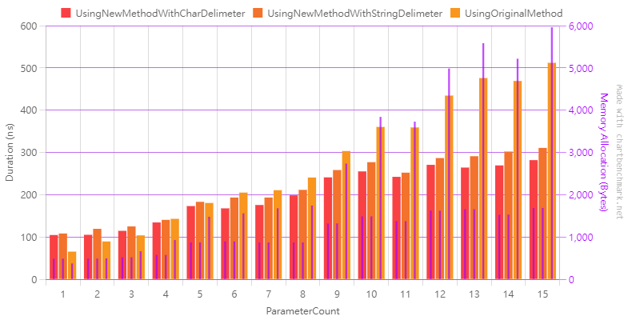

# Benchmark of [Issue #874](https://github.com/Caliburn-Micro/Caliburn.Micro/issues/874)

In this project, I've endeavored to contrast the performance of traditional string manipulation against the StringBuilder approach. Our focus has been honed on the implications of different parameter lengths.

## Dependencies

- .Net SDK >= 7.0.100 (7.0.401 was used)
- BenchmarkDotNet 0.13.9 (.NET 7.0.11)

## Hardware

- CPU: Intel(R) Core(TM) i9-10900F CPU @ 2.80GHz
- GPU: AMD Radeon RX 5700 XT

## Benchmark Workflow

1. Test Case Creation:

    Based on user-defined `ArgNumStart` and `ArgNumEnd` values (default is 1 to 15), we generate distinct methods. Each method's naming follows the convention: `RandomMethod_{param number}`. As part of the generation, each method will have its parameters' types (chosen randomly from string, int, double, or object) and parameter names, formatted as `arg_{2~21 random characters}`, decided automatically.

2. Serialization:

    Each generated method is serialized and saved to `test_data.json`, which is located adjacent to the executable. The key used for storing each serialized method is its name. This step ensures that BenchmarkDotNet utilizes consistent methods for testing, as it initiates separate processes, necessitating an external file to ensure consistency in the test data.

3. Benchmark Initialization:

    During the Global Setup phase, the program reads the json file and reconstructs the methods for benchmarking.

4. Benchmark Execution:

    We then benchmark and analyze the effect of parameter length on the conventional method and the new approach.

## How To Run Benchmark

1. Enter `Caliburn.Micro.sln`
2. Choose project `Benchmark.QL87`
3. Run with `Release` mode. Do not run with `Debug` mode.

## Benchmark Result

### Methods

- UsingNewMethodWithCharDelimeter: use `StringBuilder` with single char delimeter like `','`, `'('`, `')'`
- UsingNewMethodWithStringDelimeter : use `StringBuilder` with string delimeter like `","`, `"("`, `")"` (violate SA )
- UsingOriginalMethod: original method

### Log Result

- see benchmark_result.log

<table border="1">
<tr>
    <th>ParameterCount</th>
    <th>Method</th>
    <th>Mean</th>
    <th>Error</th>
    <th>StdDev</th>
    <th>Gen0</th>
    <th>Gen1</th>
    <th>Allocated</th>
</tr>
<tr>
    <td rowspan="3">1</td>
    <td>UsingNewMethodWithCharDelimeter</td>
    <td>104.86</td>
    <td>1.237</td>
    <td>1.096</td>
    <td>0.0466</td>
    <td>0.0</td>
    <td>488</td>
</tr>
<tr>
    <td>UsingNewMethodWithStringDelimeter</td>
    <td>108.42</td>
    <td>2.186</td>
    <td>2.518</td>
    <td>0.0466</td>
    <td>0.0</td>
    <td>488</td>
</tr>
<tr>
    <td>UsingOriginalMethod</td>
    <td>65.6</td>
    <td>1.361</td>
    <td>1.336</td>
    <td>0.0359</td>
    <td>0.0</td>
    <td>376</td>
</tr>
</tr>
<tr>
    <td rowspan="3">2</td>
    <td>UsingNewMethodWithCharDelimeter</td>
    <td>105.39</td>
    <td>2.106</td>
    <td>3.087</td>
    <td>0.0466</td>
    <td>0.0</td>
    <td>488</td>
</tr>
<tr>
    <td>UsingNewMethodWithStringDelimeter</td>
    <td>119.43</td>
    <td>2.436</td>
    <td>3.934</td>
    <td>0.0466</td>
    <td>0.0</td>
    <td>488</td>
</tr>
<tr>
    <td>UsingOriginalMethod</td>
    <td>89.57</td>
    <td>2.005</td>
    <td>5.72</td>
    <td>0.0473</td>
    <td>0.0</td>
    <td>496</td>
</tr>
</tr>
<tr>
    <td rowspan="3">3</td>
    <td>UsingNewMethodWithCharDelimeter</td>
    <td>114.78</td>
    <td>1.711</td>
    <td>1.517</td>
    <td>0.0497</td>
    <td>0.0</td>
    <td>520</td>
</tr>
<tr>
    <td>UsingNewMethodWithStringDelimeter</td>
    <td>125.15</td>
    <td>2.498</td>
    <td>3.419</td>
    <td>0.0496</td>
    <td>0.0</td>
    <td>520</td>
</tr>
<tr>
    <td>UsingOriginalMethod</td>
    <td>104.0</td>
    <td>1.647</td>
    <td>1.541</td>
    <td>0.0634</td>
    <td>0.0</td>
    <td>664</td>
</tr>
</tr>
<tr>
    <td rowspan="3">4</td>
    <td>UsingNewMethodWithCharDelimeter</td>
    <td>134.58</td>
    <td>1.241</td>
    <td>0.969</td>
    <td>0.0551</td>
    <td>0.0</td>
    <td>576</td>
</tr>
<tr>
    <td>UsingNewMethodWithStringDelimeter</td>
    <td>140.7</td>
    <td>1.09</td>
    <td>0.91</td>
    <td>0.0551</td>
    <td>0.0</td>
    <td>576</td>
</tr>
<tr>
    <td>UsingOriginalMethod</td>
    <td>143.06</td>
    <td>2.853</td>
    <td>2.93</td>
    <td>0.0887</td>
    <td>0.0</td>
    <td>928</td>
</tr>
</tr>
<tr>
    <td rowspan="3">5</td>
    <td>UsingNewMethodWithCharDelimeter</td>
    <td>173.27</td>
    <td>3.44</td>
    <td>3.049</td>
    <td>0.0832</td>
    <td>0.0</td>
    <td>872</td>
</tr>
<tr>
    <td>UsingNewMethodWithStringDelimeter</td>
    <td>183.31</td>
    <td>2.564</td>
    <td>2.273</td>
    <td>0.0832</td>
    <td>0.0</td>
    <td>872</td>
</tr>
<tr>
    <td>UsingOriginalMethod</td>
    <td>180.64</td>
    <td>3.659</td>
    <td>6.599</td>
    <td>0.1414</td>
    <td>0.0</td>
    <td>1480</td>
</tr>
</tr>
<tr>
    <td rowspan="3">6</td>
    <td>UsingNewMethodWithCharDelimeter</td>
    <td>167.87</td>
    <td>2.795</td>
    <td>2.615</td>
    <td>0.0856</td>
    <td>0.0</td>
    <td>896</td>
</tr>
<tr>
    <td>UsingNewMethodWithStringDelimeter</td>
    <td>193.48</td>
    <td>3.887</td>
    <td>3.818</td>
    <td>0.0856</td>
    <td>0.0</td>
    <td>896</td>
</tr>
<tr>
    <td>UsingOriginalMethod</td>
    <td>205.14</td>
    <td>4.143</td>
    <td>10.084</td>
    <td>0.149</td>
    <td>0.0</td>
    <td>1560</td>
</tr>
</tr>
<tr>
    <td rowspan="3">7</td>
    <td>UsingNewMethodWithCharDelimeter</td>
    <td>175.83</td>
    <td>3.301</td>
    <td>2.926</td>
    <td>0.0832</td>
    <td>0.0</td>
    <td>872</td>
</tr>
<tr>
    <td>UsingNewMethodWithStringDelimeter</td>
    <td>193.48</td>
    <td>3.843</td>
    <td>7.027</td>
    <td>0.0832</td>
    <td>0.0</td>
    <td>872</td>
</tr>
<tr>
    <td>UsingOriginalMethod</td>
    <td>210.85</td>
    <td>4.203</td>
    <td>4.671</td>
    <td>0.1607</td>
    <td>0.0</td>
    <td>1680</td>
</tr>
</tr>
<tr>
    <td rowspan="3">8</td>
    <td>UsingNewMethodWithCharDelimeter</td>
    <td>198.72</td>
    <td>3.816</td>
    <td>3.569</td>
    <td>0.0832</td>
    <td>0.0</td>
    <td>872</td>
</tr>
<tr>
    <td>UsingNewMethodWithStringDelimeter</td>
    <td>211.57</td>
    <td>2.694</td>
    <td>2.388</td>
    <td>0.0832</td>
    <td>0.0</td>
    <td>872</td>
</tr>
<tr>
    <td>UsingOriginalMethod</td>
    <td>240.76</td>
    <td>4.509</td>
    <td>4.217</td>
    <td>0.1664</td>
    <td>0.0</td>
    <td>1744</td>
</tr>
</tr>
<tr>
    <td rowspan="3">9</td>
    <td>UsingNewMethodWithCharDelimeter</td>
    <td>241.17</td>
    <td>4.398</td>
    <td>4.32</td>
    <td>0.1261</td>
    <td>0.0</td>
    <td>1320</td>
</tr>
<tr>
    <td>UsingNewMethodWithStringDelimeter</td>
    <td>258.47</td>
    <td>4.987</td>
    <td>13.137</td>
    <td>0.1259</td>
    <td>0.0</td>
    <td>1320</td>
</tr>
<tr>
    <td>UsingOriginalMethod</td>
    <td>303.45</td>
    <td>6.0</td>
    <td>5.319</td>
    <td>0.2613</td>
    <td>0.0</td>
    <td>2736</td>
</tr>
</tr>
<tr>
    <td rowspan="3">10</td>
    <td>UsingNewMethodWithCharDelimeter</td>
    <td>255.29</td>
    <td>4.626</td>
    <td>4.101</td>
    <td>0.1421</td>
    <td>0.0</td>
    <td>1488</td>
</tr>
<tr>
    <td>UsingNewMethodWithStringDelimeter</td>
    <td>277.03</td>
    <td>5.551</td>
    <td>5.452</td>
    <td>0.1421</td>
    <td>0.0</td>
    <td>1488</td>
</tr>
<tr>
    <td>UsingOriginalMethod</td>
    <td>360.37</td>
    <td>7.199</td>
    <td>15.802</td>
    <td>0.3672</td>
    <td>0.0</td>
    <td>3840</td>
</tr>
</tr>
<tr>
    <td rowspan="3">11</td>
    <td>UsingNewMethodWithCharDelimeter</td>
    <td>242.41</td>
    <td>4.669</td>
    <td>5.189</td>
    <td>0.1316</td>
    <td>0.0005</td>
    <td>1376</td>
</tr>
<tr>
    <td>UsingNewMethodWithStringDelimeter</td>
    <td>252.3</td>
    <td>3.506</td>
    <td>3.108</td>
    <td>0.1316</td>
    <td>0.0005</td>
    <td>1376</td>
</tr>
<tr>
    <td>UsingOriginalMethod</td>
    <td>359.16</td>
    <td>6.394</td>
    <td>5.34</td>
    <td>0.3562</td>
    <td>0.0005</td>
    <td>3728</td>
</tr>
</tr>
<tr>
    <td rowspan="3">12</td>
    <td>UsingNewMethodWithCharDelimeter</td>
    <td>270.79</td>
    <td>5.401</td>
    <td>9.459</td>
    <td>0.155</td>
    <td>0.0</td>
    <td>1624</td>
</tr>
<tr>
    <td>UsingNewMethodWithStringDelimeter</td>
    <td>286.77</td>
    <td>5.773</td>
    <td>6.416</td>
    <td>0.155</td>
    <td>0.0</td>
    <td>1624</td>
</tr>
<tr>
    <td>UsingOriginalMethod</td>
    <td>434.49</td>
    <td>8.543</td>
    <td>12.786</td>
    <td>0.4759</td>
    <td>0.0</td>
    <td>4984</td>
</tr>
</tr>
<tr>
    <td rowspan="3">13</td>
    <td>UsingNewMethodWithCharDelimeter</td>
    <td>264.33</td>
    <td>4.585</td>
    <td>4.289</td>
    <td>0.1583</td>
    <td>0.0</td>
    <td>1656</td>
</tr>
<tr>
    <td>UsingNewMethodWithStringDelimeter</td>
    <td>291.13</td>
    <td>4.872</td>
    <td>4.319</td>
    <td>0.1583</td>
    <td>0.0</td>
    <td>1656</td>
</tr>
<tr>
    <td>UsingOriginalMethod</td>
    <td>475.97</td>
    <td>9.174</td>
    <td>9.816</td>
    <td>0.5341</td>
    <td>0.0</td>
    <td>5584</td>
</tr>
</tr>
<tr>
    <td rowspan="3">14</td>
    <td>UsingNewMethodWithCharDelimeter</td>
    <td>269.41</td>
    <td>5.375</td>
    <td>5.52</td>
    <td>0.1459</td>
    <td>0.0</td>
    <td>1528</td>
</tr>
<tr>
    <td>UsingNewMethodWithStringDelimeter</td>
    <td>302.15</td>
    <td>5.558</td>
    <td>9.287</td>
    <td>0.1459</td>
    <td>0.0</td>
    <td>1528</td>
</tr>
<tr>
    <td>UsingOriginalMethod</td>
    <td>469.12</td>
    <td>9.183</td>
    <td>13.17</td>
    <td>0.4988</td>
    <td>0.0</td>
    <td>5216</td>
</tr>
</tr>
<tr>
    <td rowspan="3">15</td>
    <td>UsingNewMethodWithCharDelimeter</td>
    <td>281.93</td>
    <td>5.566</td>
    <td>5.207</td>
    <td>0.1612</td>
    <td>0.0</td>
    <td>1688</td>
</tr>
<tr>
    <td>UsingNewMethodWithStringDelimeter</td>
    <td>310.79</td>
    <td>5.256</td>
    <td>4.916</td>
    <td>0.1612</td>
    <td>0.0</td>
    <td>1688</td>
</tr>
<tr>
    <td>UsingOriginalMethod</td>
    <td>512.0</td>
    <td>10.204</td>
    <td>10.021</td>
    <td>0.5693</td>
    <td>0.0</td>
    <td>5960</td>
</tr>
</table>

### Visualization

The plot was generated by [Charts for BenchmarkDotNet](https://chartbenchmark.net/)


## Conclusion

It has been observed that when the number of parameters is between ==4 and 5==, the performance of `StringBuilder` starts to surpass direct string concatenation. However, for several functions with parameter counts mainly between 3 to 4, using `StringBuilder` might not necessarily yield better performance. Therefore, it is recommended to modify the program accordingly.

```c#
string message;
var parameters = method.GetParameters();

if (parameters.Length == 0) 
{
    message = method.Name;
} 
else if (parameters.Length < 4) 
{
    message = method.Name + "(";

    foreach (var parameter in parameters) 
    {
        var paramName = parameter.Name;
        message += paramName + ",";
    }

    message = message.Remove(message.Length - 1, 1);
    message += ")";
} 
else 
{
    var builder = new StringBuilder(method.Name);
    builder.Append('(');

    foreach (var parameter in parameters) 
    {
        var paramName = parameter.Name;
        var specialValue = "$" + paramName.ToLower();

        if (MessageBinder.SpecialValues.ContainsKey(specialValue))
            paramName = specialValue;

        builder.Append(paramName);
        builder.Append(',');
    }

    builder = builder.Remove(builder.Length - 1, 1);
    builder.Append(')');

    message = builder.ToString();
}
```
However, such modifications might complicate the program further, so it requires careful consideration.Please be aware that the test results may be platform-dependent.
